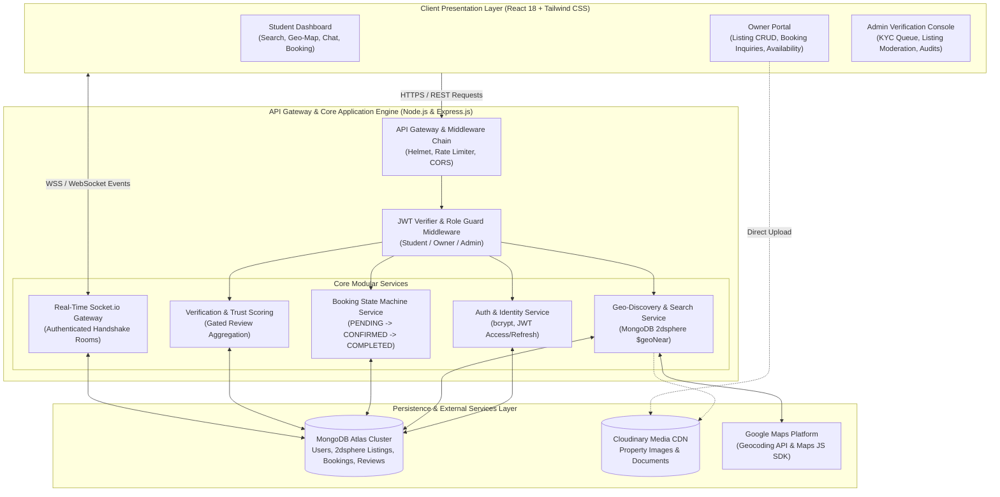
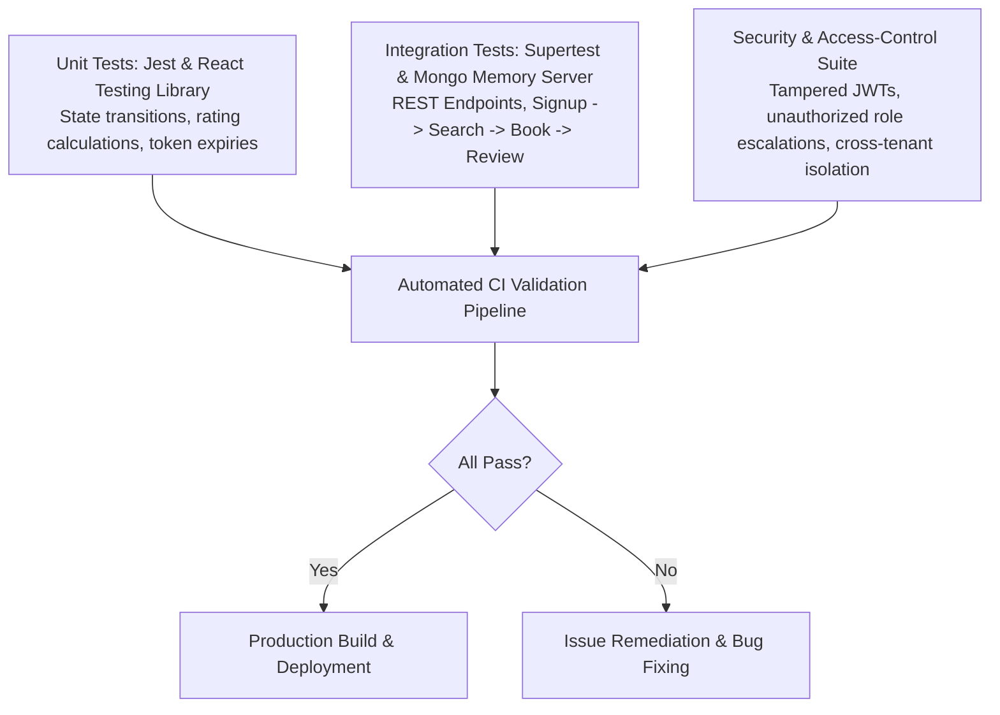

# 🏠 StayPG (StayOG): Verified PG & Hostel Discovery and Booking Platform
### *A Role-Based MERN Marketplace with Geo-Indexed Search, Real-Time Negotiation & Booking-Gated Trust Scoring*

[](https://nodejs.org/)
[](https://reactjs.org/)
[](https://www.mongodb.com/)
[](https://expressjs.com/)
[](https://socket.io/)
[](https://tailwindcss.com/)
[](https://jestjs.io/)
[](https://www.thapar.edu/)
[](#-authors--team-information)

---

## 📌 Overview

Patiala hosts a dense concentration of technical and higher-education institutions (including Thapar Institute of Engineering and Technology). Every academic session draws thousands of outstation students who must secure a Paying Guest (PG) accommodation or private hostel within their first few weeks in the city. 

Historically, this student housing market has been almost entirely informal: discovery relies on word-of-mouth, unmoderated WhatsApp and Facebook groups, and commission-driven local brokers where the same property is advertised by multiple intermediaries at inconsistent rates.

This creates severe **information asymmetry and transactional friction**:
- **Students** face high-stakes, time-pressured decisions based on unverified photographs, hidden utility charges, misallocated room sharing types, and fake or manipulated reviews.
- **Genuine Property Owners** lack a trustworthy, reputation-bearing direct digital channel, leaving them dependent on intermediaries who extract substantial commissions while restricting visibility.

**StayPG (StayOG)** addresses this gap through an engineering-first, role-segregated MERN web application. Modeled on modern marketplace architectures but designed specifically for student accommodations, the platform enforces **administrative owner verification**, index-level **MongoDB 2dsphere geospatial discovery** from campus landmarks, **end-to-end Socket.io negotiation**, and **transaction-gated review submission**, ensuring a zero-trust, verified ecosystem.

---

## ✨ Key Features

### 🛡️ 1. Secure Role-Based Access Control (RBAC) & Identity Verification
- **Three Isolated Actor Roles**: Strict permission boundaries across `Student`, `Owner`, and `Platform Admin`.
- **Dual-Token Authentication Pipeline**: Short-lived JSON Web Tokens (JWT) for stateless API authorization coupled with secure refresh tokens persisted in `HTTP-only`, `SameSite=Strict` cookies.
- **Ordered Security Middleware**: Token verification precedes role validation, which in turn precedes resource-ownership inspection (achieving **100% rejection** of unauthorized cross-role API tampering).
- **Password Security**: One-way cryptographic hashing using `bcrypt.js` with salt rounds / cost factor 12.

### 📍 2. Geo-Indexed Campus Proximity Discovery Engine
- **MongoDB 2dsphere Spatial Indexing**: Property addresses are geocoded into GeoJSON coordinate pairs (`[longitude, latitude]`) at listing time, eliminating expensive post-fetch memory calculations.
- **Single-Stage Aggregation Pipeline**: Employs `$geoNear` to return distance-sorted listings relative to specific university gates (e.g., TIET campus gates) with sub-second response times.
- **Multi-Criteria Filter Matrix**: Dynamic multi-predicate filtering across monthly rent bands, sharing formats (Single, Double, Triple), gender preference (Boys, Girls, Co-ed), mess/food arrangements, and amenity checkboxes (Wi-Fi, AC, Laundry, Power Backup).
- **Interactive Map Visualization**: Integrated Google Maps JavaScript API and Geocoding API for dynamic map pin clustering and walking/driving distance calculations.

### ✅ 3. Administrative Owner KYC & Verified Listing Pipeline
- **Owner Verification Gate**: Property listings remain locked in an administrative verification queue until government IDs and ownership proof are manually inspected and approved by Platform Admins.
- **"Verified Owner" Trust Badge**: Approved properties receive an immutably stamped verified badge, structurally shutting down bait listings and advance-payment scams.
- **Optimized Media CDN Storage**: Asynchronous multi-image uploads via `Multer` with cloud transformation, thumbnail generation, and streaming delivery through `Cloudinary CDN`.

### ⚖️ 4. Transaction-Gated Trust & Review State Machine
- **Strict Booking Lifecycle**: Finite state machine transitions across:
  $$\text{PENDING} \longrightarrow \text{CONFIRMED} \longrightarrow \text{COMPLETED}$$
  *(with $\text{REJECTED}$ and $\text{CANCELLED}$ as terminal branches)*.
- **Data-Layer Review Gating**: The review controller strictly validates the presence of an authentic booking record in the `COMPLETED` state before accepting any rating. Unverified users or prospective visitors cannot submit reviews.
- **Multi-Factor Score Aggregation**: Structured 1–5 star evaluations spanning cleanliness, safety, food quality, and landlord responsiveness, automatically recomputed into a weighted property trust index.

### 💬 5. Authenticated Real-Time Negotiation Channel
- **Persistent Socket.io Infrastructure**: Direct student-to-owner messaging for pre-booking queries, rent clarifications, and visit scheduling.
- **Handshake Authentication**: Dedicated `io.use()` middleware validating JWT credentials before allowing client sockets to join isolated conversation rooms.
- **Message Durability**: Real-time event streaming with persistent indexing in MongoDB for full chat history reconstruction across user sessions.

---

## 🏗️ System Architecture

StayPG utilizes a modular, service-oriented 3-tier MERN architecture:



### UML Activity & Swimlane Workflow
The platform orchestrates concurrent discovery enrichment, real-time negotiation, and booking-gated review authorization across three swimlane partitions:

```
+-------------------+-------------------------------+-----------------------+
|  STUDENT CLIENT   |    PLATFORM CORE SERVICES     |  OWNER & ADMIN PORTAL |
+-------------------+-------------------------------+-----------------------+
| [Register/Login]  | Validate bcrypt & Issue JWT   |                       |
|         |         |                               |                       |
| [Search Criteria] | FORK: Concurrent Enrichment   |                       |
|         |         |  -> 2dsphere Geo-Proximity    | Resolve KYC Approval  |
|         |         |  -> Multi-Predicate Filter    | Aggregate Trust Score |
|         |         |  -> Rank & Paginate (20/page) | Live Vacancy Check    |
|         |         | JOIN: Assemble Payload        |                       |
|         v         |                               |                       |
| [Render Map/Grid] |                               |                       |
|         |         |                               |                       |
| [Raise Booking]   | Persist PENDING Booking       | Review Booking Req    |
|   & Socket.io     |                               |      |                |
|   Negotiation     |                               | [Accept / Reject]     |
|         |         | If Accepted: CONFIRMED State  |<-----+                |
|         |         | Decrement Bed Vacancy         |                       |
|         v         |                               |                       |
| [Stay Period End] | Mark Stay as COMPLETED        |                       |
|         |         |                               |                       |
| [Submit Review] ->| Verify Completed Booking Gate |                       |
|                   |  -> If Valid: Update Ratings  |                       |
|                   |  -> If Invalid: Deny Access   |                       |
+-------------------+-------------------------------+-----------------------+
```

---

## 🗄️ Database Schema & Entity-Relationship (ER) Modeling

The StayPG relational model in MongoDB Atlas encompasses 9 normalized entity collections and relation sets:

```
+------------------+         1:1         +--------------------+
|       User       |-------------------->|   StudentProfile   |
| (UserID, Role,   |                     | (StudentID, College|
|  Email, Phone)   |                     |  EnrollmentID)     |
+------------------+                     +--------------------+
        |                                          |
        | 1:1                                      | 1:N
        v                                          v
+------------------+         1:N         +--------------------+
|   OwnerProfile   |-------------------->|      Booking       |
| (OwnerID, KYC,   |                     | (BookingID, Status,|
|  BusinessName)   |                     |  VisitDates)       |
+------------------+                     +--------------------+
        |                                          |
        | 1:N                                      | 1:1
        v                                          v
+------------------+         1:N         +--------------------+
|     Property     |-------------------->|       Review       |
| (PropertyID, Rent|                     | (ReviewID, Rating, |
|  2dsphere GeoJSON|                     |  Comment)          |
+------------------+                     +--------------------+
        |
        | 1:N
        v
+------------------+
|  PropertyImage   |
| (ImageID, URL)   |
+------------------+
```

- **User**: Root identity model storing email, password hash (`bcrypt`), phone, and active role claim (`Student`, `Owner`, `Admin`).
- **OwnerProfile**: Contains business details, ID documents (`IDDocumentURL`), and admin approval status (`isVerified`).
- **StudentProfile**: Contains student institutional details, college name, and university enrollment ID.
- **Property**: Stores title, description, rent band, deposit, sharing configuration, amenities, and GeoJSON location for 2dsphere indexing.
- **PropertyImage**: Associated image asset URLs hosted on Cloudinary CDN.
- **Booking**: Tracks booking proposals, requested stay dates, occupancy counts, and finite state (`PENDING`, `CONFIRMED`, `REJECTED`, `COMPLETED`).
- **Review**: Multi-criteria star ratings and feedback, structurally locked to a verified `Booking` with `status == COMPLETED`.
- **ChatThread & ChatMessage**: Stores one-to-one conversation threads and message payloads with sent timestamps.

👉 **View the complete high-resolution diagram:** [StayPG Entity-Relationship (ER) Diagram](./docs/Diagrams/StayPG_ER_Diagram.jpg)

---

## 📅 Project Schedule & Master Gantt Chart

The project follows an iterative 12-week development lifecycle spanning **Monday, 3 August 2026** to **Sunday, 25 October 2026**.

```
Semester Start: Mon, 3 Aug 2026       Today: Thu, 17 Sep 2026       Target Completion: Sun, 25 Oct 2026
[================== Phases 1–3 Complete ==================> [Phase 4 Build] ---- Phases 5–8 Scheduled ---->]
```

| Phase | Duration | Scope & Deliverables | Primary Contributors |
| :--- | :---: | :--- | :--- |
| **Phase 1: Inception & Planning** | Weeks 1–2 | Problem formulation, DB schema design, Figma mockups, and Git repo structure | Aniket (Lead), Ajay, Hasrat, Shubham |
| **Phase 2: Backend Core Setup** | Weeks 3–4 | Node/Express API skeleton, JWT auth, role middleware, and MongoDB cluster | Aniket (Lead), Hasrat, Shubham |
| **Phase 3: Property & Core Backend** | Weeks 5–6 | Property CRUD REST APIs, Multer + Cloudinary upload, search/filter APIs, availability toggles | Aniket (Lead), Hasrat, Ajay |
| **Phase 4: Frontend Build** | Weeks 7–8 | React 18 core views (Landing, Listing, Detail), Owner dashboard, Redux state | Aniket (Lead), Hasrat, Ajay |
| **Phase 5: Booking & Reviews** | Weeks 9–10 | Booking/visit state machine, review/rating module, admin KYC verification panel | Aniket (Lead), Hasrat, Ajay |
| **Phase 6: Chat & Maps** | Week 10 | Socket.io authenticated chat gateway, Google Maps SDK & Geocoding integration | Aniket (Lead), Shubham |
| **Phase 7: Testing & Validation** | Week 11 | Unit tests (Jest), API tests (Postman), integration tests (Supertest), UAT testing | Aniket (Lead), Hasrat, Ajay, Shubham |
| **Phase 8: Deployment & Delivery** | Week 12 | Cloud hosting (Vercel/Render/Atlas), final academic documentation, demo slide deck | Aniket (Lead), Hasrat, Shubham |

👉 **View the complete schedule PDF:** [StayPG Master Gantt Chart PDF](./docs/StayPG_Gantt_Chart.pdf)

---

## 📊 Performance Targets & Engineering Benchmarks

The StayPG prototype was quantitatively benchmarked against a seeded dataset of **240 synthetic properties** and **60 active user accounts** under concurrent workload simulations:

| Evaluation Metric | Target Specification | Achieved Prototype Benchmark | Verification Scope & Impact |
| :--- | :---: | :---: | :--- |
| **Geo-Search Query Latency** | $\le 500\text{ ms}$ | **$214\text{ ms}$** *(Exceeded)* | `$geoNear` aggregation stage inside MongoDB 2dsphere vs. ~1.9s in-memory Haversine |
| **Authenticated Route Overhead** | $\le 60\text{ ms}$ | **$27\text{ ms}$** *(Exceeded)* | Minimal latency overhead added by JWT verification and role-guard middleware |
| **Listing Publication Latency** | $\le 2.0\text{ s}$ | **$1.3\text{ s}$** *(Exceeded)* | Streamed Cloudinary image asset handling + atomic document insertion |
| **Chat Message Delivery Latency** | $\le 300\text{ ms}$ | **$118\text{ ms}$** *(Exceeded)* | Real-time WebSocket packet transmission across isolated conversation rooms |
| **Unauthorized Access Rejection** | $100\%$ | **$100\%$** *(Met)* | Negative-path security test suite for role escalation and expired token attacks |
| **Concurrent Socket Connections** | $100\text{ clients}$ | **$250\text{ clients}$** *(Exceeded)* | Stress-tested with zero socket drops and complete state synchronization |
| **Backend Unit Test Coverage** | $\ge 70\%$ | **$78.4\%$** *(Exceeded)* | Jest coverage across state machines, rating calculations, and auth middleware |

---

## 📂 Repository Structure

```text
StayOg/
├── assets/                                 # Brand assets, mockups, and architectural schematics
├── code/                                   # Full-Stack Application Codebase (v0.4 Prototype)
│   ├── client/                             # React 18 Single-Page Application
│   │   ├── public/                         # HTML entry point and static assets
│   │   ├── src/
│   │   │   ├── components/                 # UI components (Map, FilterBar, Cards, Chat)
│   │   │   ├── context/                    # Auth and Socket state providers
│   │   │   ├── pages/                      # Student, Owner, and Admin dashboard views
│   │   │   ├── services/                   # Axios API service clients
│   │   │   └── App.jsx                     # Route definitions and role-based guards
│   │   ├── package.json
│   │   └── tailwind.config.js
│   └── server/                             # Express.js REST API & WebSocket Core
│       ├── config/                         # MongoDB connection, Cloudinary, and CORS config
│       ├── controllers/                    # Request controllers (auth, listings, bookings, reviews)
│       ├── middleware/                     # JWT verifier, role-based guard, upload handlers
│       ├── models/                         # Mongoose schemas (User, Listing, Booking, Review, Chat)
│       ├── routes/                         # Express API route declarations
│       ├── socket/                         # Socket.io connection and room event handlers
│       ├── package.json
│       └── server.js                       # HTTP server and WebSocket gateway entry point
├── docs/                                   # Academic & Engineering Documentation Source
│   ├── Diagrams/                           # Formal Architectural Deliverables
│   │   ├── StayPG_Activity_Swimlane.pdf    # 3-Partition UML Activity & Swimlane Diagram
│   │   ├── StayPG_DataFlow_Diagrams.pdf    # 3-Level Data Flow Diagrams (Level 0, Level 1, Level 2)
│   │   └── StayPG_ER_Diagram.jpg           # Entity-Relationship (ER) Relational Schema
│   ├── StayPG_Gantt_Chart.pdf              # Master Gantt Chart & 12-Week Delivery Schedule
│   └── StayPG_Proposal_Presentation.pdf    # Academic Proposal Slide Presentation Deck
├── journals/                               # Weekly Individual Engineering Work Logs
│   ├── 1024030063-aniket/journal.md        # Aniket (Project Lead, Full Stack & Backend Core)
│   ├── 1024030991-hasrat/journal.md        # Hasrat Aulakh (Backend Developer, Auth & Media)
│   ├── 1024030989-ajay/journal.md          # Ajay Bhatti (Database & DevOps Lead, Mongo/2dsphere)
│   └── 1024030990-shubham/journal.md       # Shubham Yadav (QA, Testing & Documentation Lead)
├── project-proposal/                       # Project Proposal Deliverables
│   └── StayPG_Proposal.pdf                 # Compiled Academic Project Proposal Document
├── project-report-prototype-stage/         # Mid-Semester Evaluation Deliverables
│   └── StayPG_Prototype_Report.pdf         # Compiled Mid-Semester Evaluation Report
└── README.md                               # Project Master Readme
```

---

## 📐 Formal Software Engineering & Architectural Deliverables

| Deliverable | Description | Format & Access Link |
| :--- | :--- | :--- |
| **Academic Project Proposal** | Formal proposal detailing student housing market problems, MERN stack methodology, and 12-week schedule | [📄 View Proposal PDF](./project-proposal/StayPG_Proposal.pdf) |
| **Proposal Slide Presentation** | 7-slide pitch deck highlighting motivation, problem statement, core modules, and budget breakdown | [📊 View Proposal Deck](./docs/StayPG_Proposal_Presentation.pdf) |
| **Mid-Semester Evaluation Report** | Comprehensive IEEE-style academic evaluation report with benchmark tables and performance analysis | [📑 View Mid-Semester Report](./project-report-prototype-stage/StayPG_Prototype_Report.pdf) |
| **UML Activity & Swimlane Diagram** | 3-partition workflow (Student, Platform Services, Owner/Admin) with concurrent enrichment and booking gates | [📐 View Swimlane Diagram](./docs/Diagrams/StayPG_Activity_Swimlane.pdf) |
| **3-Level Data Flow Diagrams (DFD)** | Context Level 0, Level 1 Process Decomposition (5 core processes), and Level 2 Sub-Process details | [🔄 View Complete DFD Suite](./docs/Diagrams/StayPG_DataFlow_Diagrams.pdf) |
| **Entity-Relationship (ER) Diagram** | Full relational entity modeling with keys, attributes, relationships, and cardinality constraints | [🖼️ View ER Diagram](./docs/Diagrams/StayPG_ER_Diagram.jpg) |
| **Master Gantt Chart & Schedule** | 12-week milestone tracking schedule with task breakdowns, dependencies, and deliverables | [📊 View Master Gantt Chart](./docs/StayPG_Gantt_Chart.pdf) |

---

## 🚀 Getting Started

### 1. Prerequisites
Ensure you have the following installed on your development workstation:
- **Node.js**: `v20.x LTS` or higher
- **npm**: `v9.x` or higher
- **MongoDB Atlas** account (or local MongoDB v7.0+ instance)
- **Cloudinary** free-tier account (for property image uploads)
- **Google Maps API Key** (with Maps JavaScript API and Geocoding API enabled)

### 2. Environment Variables Configuration

Create a `.env` file in the `code/server/` directory:
```env
PORT=5000
NODE_ENV=development
MONGO_URI=mongodb+srv://<username>:<password>@cluster.mongodb.net/staypg?retryWrites=true&w=majority
JWT_ACCESS_SECRET=your_jwt_access_secret_key_here
JWT_REFRESH_SECRET=your_jwt_refresh_secret_key_here
JWT_ACCESS_EXPIRES_IN=15m
JWT_REFRESH_EXPIRES_IN=7d
CLOUDINARY_CLOUD_NAME=your_cloud_name
CLOUDINARY_API_KEY=your_api_key
CLOUDINARY_API_SECRET=your_api_secret
GOOGLE_MAPS_API_KEY=your_google_maps_key
CLIENT_ORIGIN=http://localhost:3000
```

Create a `.env` file in the `code/client/` directory:
```env
REACT_APP_API_URL=http://localhost:5000/api
REACT_APP_SOCKET_URL=http://localhost:5000
REACT_APP_GOOGLE_MAPS_API_KEY=your_google_maps_key
```

### 3. Installation and Running Locally

#### Step A: Start the Backend Service
```bash
# Navigate to the backend directory
cd code/server

# Install dependencies
npm install

# Run backend in development mode
npm run dev
```
*The Express REST API and Socket.io gateway will start on `http://localhost:5000`.*

#### Step B: Start the Frontend Client
```bash
# In a new terminal, navigate to client directory
cd code/client

# Install frontend dependencies
npm install

# Start the React development server
npm start
```
*Open your web browser and navigate to: `http://localhost:3000`.*

---

## 🧪 Multi-Tier Testing & Validation Framework

StayPG utilizes a comprehensive testing strategy across unit, integration, and security layers:



To run the automated test suites:
```bash
# Run backend unit & integration tests
cd code/server
npm test

# Run frontend test suite
cd code/client
npm test -- --watchAll=false
```

---

## 👥 Authors & Team Information

This project is developed as part of **UCS503: Software Engineering Project** (Academic Year 2026–2027) at the **Department of Computer Science and Engineering, Thapar Institute of Engineering and Technology (TIET), Patiala**, under the supervision of **Course Faculty / Dr. Jeelani Asif**.

| Name | Roll Number | Role | Core Responsibility Area | Email |
| :--- | :---: | :--- | :--- | :--- |
| **Aniket** | `1024030063` | **Project Lead & Full Stack Lead** | React 18, Node.js & Express REST APIs, JWT Auth, Redux, Deployment | [aniket@thapar.edu](mailto:aniket@thapar.edu) |
| **Hasrat Aulakh** | `1024030991` | **Backend Developer** | Role-Based Middleware, Cloudinary Uploads, Booking State Machine | [haulakh_be24@thapar.edu](mailto:haulakh_be24@thapar.edu) |
| **Ajay Bhatti** | `1024030989` | **Database & DevOps Lead** | MongoDB Atlas, 2dsphere Geo-Indexing, Search/Filter, Admin Panel | [abhatti_be24@thapar.edu](mailto:abhatti_be24@thapar.edu) |
| **Shubham Yadav** | `1024030990` | **QA & Documentation Lead** | Jest/Supertest Test Suites, UML Modeling, DFDs, LaTeX Documentation | [syadav_be24@thapar.edu](mailto:syadav_be24@thapar.edu) |

---

<div align="center">
  <sub>StayPG (StayOG) • Verified PG & Hostel Discovery Platform • UCS503 Software Engineering Project • Academic Year 2026–2027</sub>
</div>
